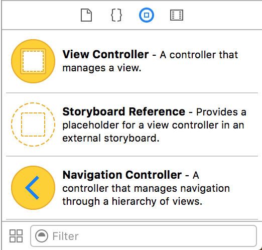
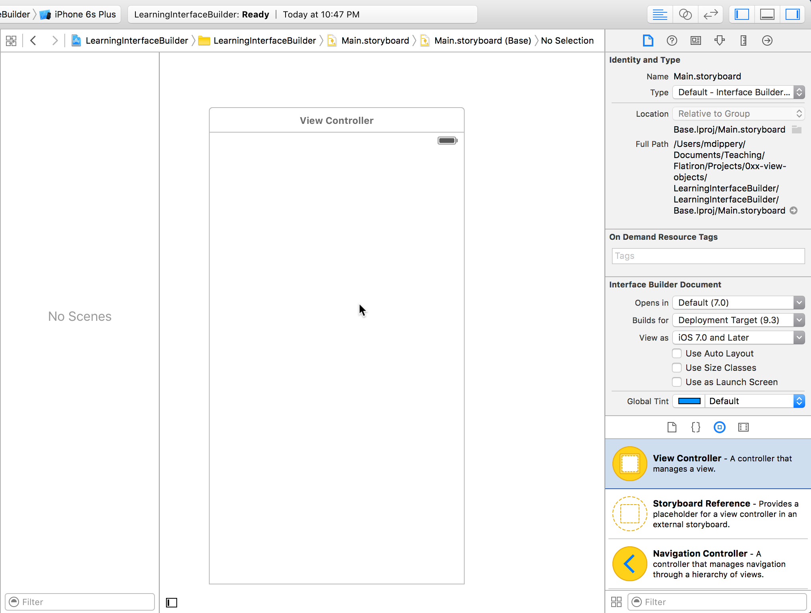
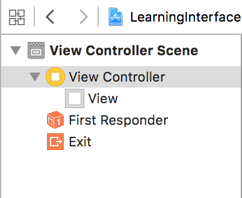
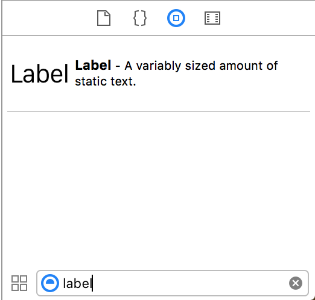
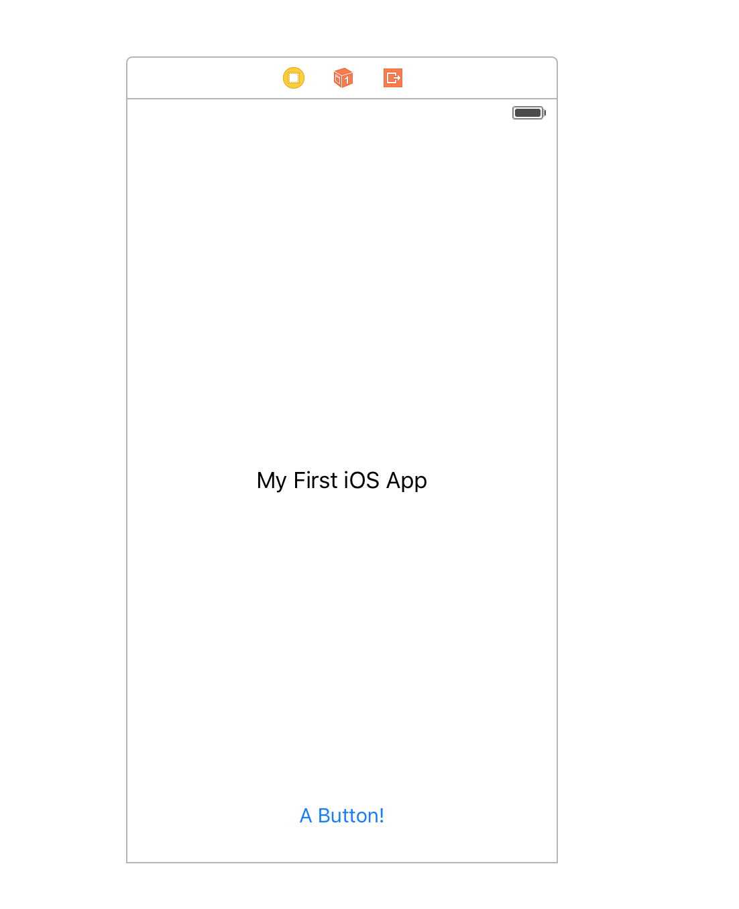
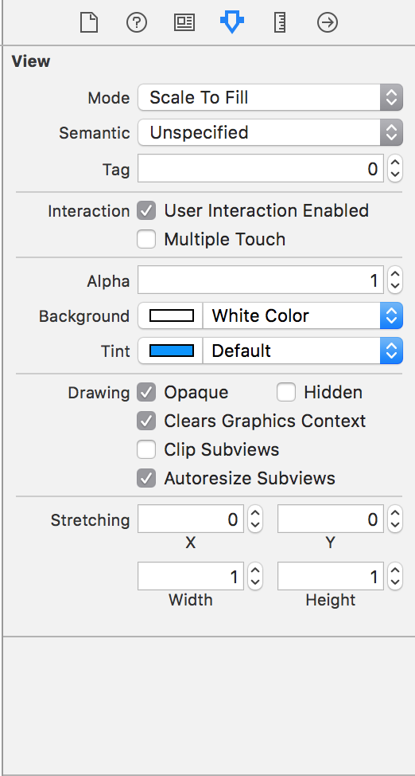
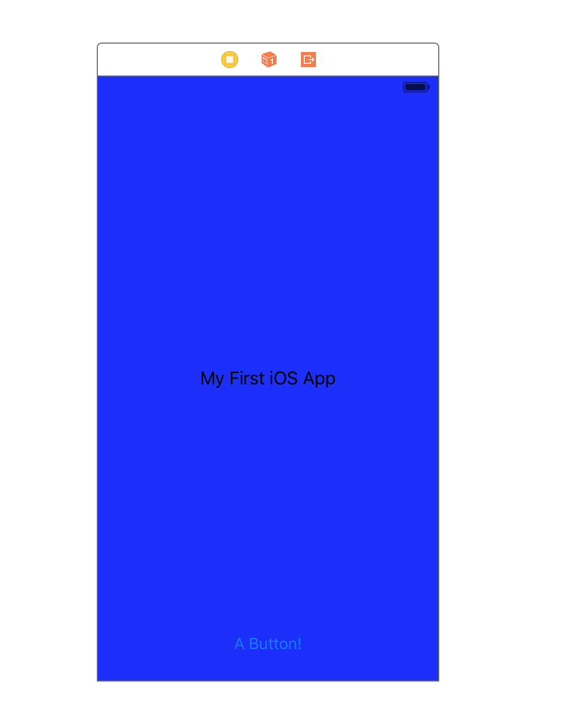
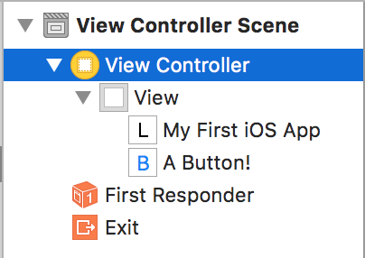
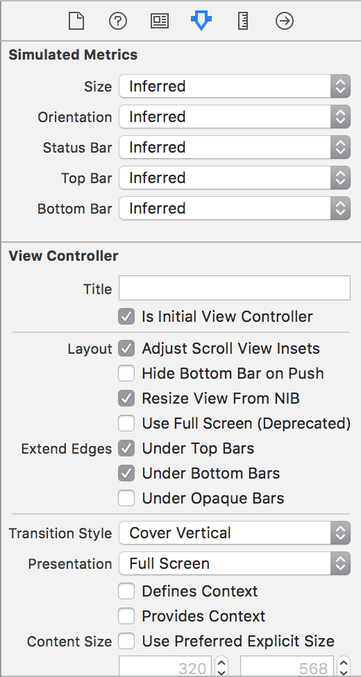
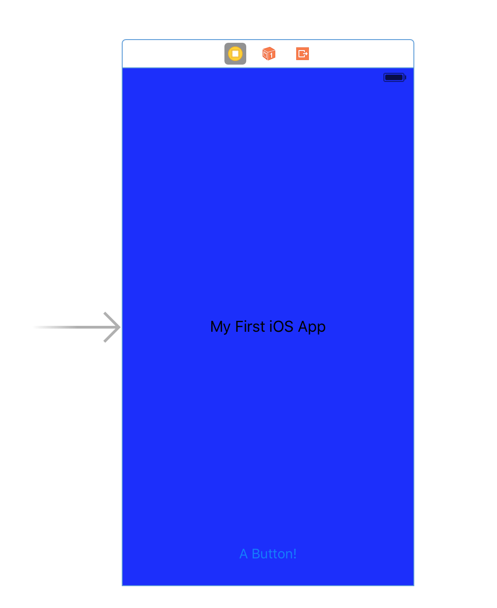

# Interface Builder: View Objects

> Sometimes the questions are complicated and the answers are simple.

## Learning Objectives - The student should be able to...

* Locate the Object Library in Xcode.
* Drag & drop a **View Controller** object onto the canvas.
* Hide and Show the Document Outline to view a breakdown of the View Controller Scene.
* Explain that a View is provided along with every **View Controller Scene**.
* Explain that a **UIView** represents the rectangular area on the screen which manages all of the content that is placed within it. It is the main way the application interacts with the user.
* Drag & drop a **Label** from the Object library onto the View.
* Drag & drop a **Button** from the Object library onto the View.
* Explain that the Attributes inspector is where they can edit attributes of the selected object. For example, changing the background color of their view.
* Change the background color of the View by selecting the View from within their storyboard file, click the Attributes inspector and change the Background color from the drop down menu.
* Select their View Controller as being the "Initial View Controller" in the Attributes Inspector 

## What the student can do at this point 

* Has a general overview of Xcode and is able to create a new project.
* Knows where to locate the testing file within Xcode.
* Knows how to navigate to Interface Builder. 
* Knows what a storyboard file is.
* Has a brief overview of what the Object Library is.
* Can drag a View Controller onto the canvas.

## View Objects

Now that you know your way around Xcode (and specifically Interface Builder) a bit, it's time to take a closer look at how to lay out the graphical user interface of your application. As you do, we'll take a closer look at some of the concepts that come into play when you're working with _views_ in Xcode.

First, open up the Xcode project provided in this repo. (It is at `LearningInterfaceBuilder/LearningInterfaceBuilder.xcodeproj`.) Then open up `Main.storyboard` in Interface Builder. Do you remember how to do that? If not, here's some help: Click once on `Main.storyboard` in the file listing at the left-hand side of the Xcode window. You should see the storyboard in Interface Builder.

What do you see? An empty canvas! Right now, `Main.storyboard` is empty, as evidenced by the scene listing, which simply says **No Scenes**, as well as the fact that there is nothing on the _canvas_ (the area where you drag and drop view objects). That's about to change.

### View Controllers

The first thing you need to do is add a _view controller_ to the storyboard. As its name suggests, a view controller manages a single _view_. By "manage", we mean that it is responsible for coordinating how the view is drawn, and detecting any user input, such as touches or swipes. We'll talk about _views_ in a minute, but for now, let's get a view controller on that canvas.

Do you remember where the _object library_ is? It's the pane at the bottom of the right-hand sidebar that contains a bunch of yellow icons. It looks like this:

The object library contains all the different view objects—controllers, buttons, icons, and so forth—that can appear in your application. The top icon should be marked **View Controller**. That's what you want to add to your storyboard, so go ahead and drag that onto your canvas.

You've just added a new view controller to your storyboard! This view controller will be responsible for managing the initial view of your application—everything the user sees when they first load your application.

### Document Outline

Notice that pane immediately to the left of Interface Builder's canvas, and to the right of the file listing? That's the _document outline_. When you first opened `Main.storyboard`, it was empty, and simply said **No Scenes**. Notice anything different? You should! Now that you have added a view controller, you'll see **View Controller Scene** in the document outline. There are _disclosure triangles_ next to that entry that show you all the objects associated with that scene.

The first one is labeled **View Controller**. That's the object you just added to your storyboard by dragging it from the object library to the canvas. Underneath that View Controller entry is one called **View**. And that's what we'll talk about next.

### Views

Simply put, a view controller manages a single *view*. But what is a view? A view is an object that draws something on the screen. That could be a button, or an image, or some text. A view may even contain other views, called _subviews_, that are responsible for drawing a smaller portion of the screen. Views can also detect when they are touched, swiped, poked, or otherwise interacted with. They may respond to user interactions themselves, or they may simply pass them on to their view controller to deal with them instead.

Every view is responsible for a certain area of the screen. The default view provided with a view controller manages the _entire_ screen, but a view may contain other views that are responsible for just a small section of it.

In technical terms, a view is an instance of `UIView`, a class provided by the Cocoa Touch framework, so you may often hear views referred to as `UIView`s.

Let's take a look at some of the stuff you can do with a view.

### Labels

You've probably already guessed that a _label_ is a piece of text that you can display in your application, but did you know that a label is also a _view_? In fact, anything you place on screen in your application is a view. Views are just things that can be drawn to the screen!

Let's add a label to your application. First, find a label in the object library. Instead of scrolling through the list to find a label, you can search for it by entering **label** in the **Filter** field.

Drag and drop a label onto the view controller you created earlier. Put it anywhere in the view you like. Make sure you drag it onto the _view_ and not just the canvas!

You can double-click on the label to edit its text. Change it to anything you want. "My First iOS App" is a good label, don't you think?

Labels are very commonly used in graphical interfaces. Like views, they are a core component of the Cocoa Touch framework. They are instances of the class `UILabel`, and are often referred to as `UILabel`s.

Now that you've added a label, let's add a button.

### Buttons

Like labels, buttons are also views. (Are you starting to see a theme here?) They are responsible for drawing themselves, as well as detecting presses from the user. Let's add a button to your view. Again, you can find buttons in the object library. Make your search easier by typing **button** in the **Filter** field. Drag a button onto your view. After you've added a button, your view should look something like this:

Buttons are also a common part of graphical user interfaces, and are a standard component in Cocoa Touch. Their class is `UIButton`, so they are sometimes called `UIButton`s, too.

Now that you've added some views to your application, let's take a look at how you can change their _attributes_.

### Attributes

Every view component has a set of _attributes_ that allow you to customize how they look and behave. Attributes are set in the view's _Attributes Inspector_, which is found on the right-hand sidebar in Interface Builder.

Let's change the background color of the main view to something other than white (because white is kind of boring, don't you think?). First, select the view. You can select the view by clicking anywhere in the blank white rectangle on your canvas. But _don't_ click on the label or button you created, or you will select them instead!

Once the view is selected, bring up the Attributes Inspector. The Attributes Inspector is the _fourth_ button from the left in the right-hand sidebar. It kind of looks like a downwards-facing arrow:

Selecting that button will bring up the Attributes Inspector in Interface Builder's right-hand sidebar. Here you will see a number of options you can set:

These attributes let you customize the look and feel of your views. You won't have to worry about most of them for now. For this lesson, the important one is the one labeled **Background**. As its name suggests, that attribute controls the color of the view's background. Go ahead and click on it to change the color to your favorite color (unless your favorite color is white, in which case change it to your second favorite color). Blue is nice, isn't it? After changing the color, your view will look something like this:

### Initial View Controller

One more thing: Right now, if you try to run your app, you'll get a warning that you haven't sent an initial view controller. The _initial view controller_ is the view controller that determines what the user sees when they first launch your application. Every application has to have an initial view controller. It's easy to designate a particular view controller as the _initial view controller_. First, make sure your view controller is selected in the object listing. You'll have to select it there, as you can't select it directly in the canvas:

Once you've selected the view controller in the object listing, bring up its Attribute Inspector. Do you see an option marked **Is Initial View Controller** in the second section in the Attribute Inspector? Check that box to mark your view controller as the initial view controller.

Perfect! Now your view controller is in the initial view controller. You'll see that there is a grey arrow pointing into it to let you know that it is the starting point of your application.

And that's it for this lesson! You can build and run your application to see it in the simulator. It's good to get into the habit of frequently building and running your app to get a feel for how it's working (and catching compiler errors early, before they start to pile up). As your application becomes more complex, it'll be easy to track down bugs if you test out your application even after minor changes. Try making some adjustments to your label (perhaps by changing the text or the background color), then run the app and test it out. Then try making some changes to the button, and test your app out again. Get used to this code-build-run cycle, because you'll be doing it often!

<a href='https://learn.co/lessons/InterfaceBuilderConfig' data-visibility='hidden'>View this lesson on Learn.co</a>
